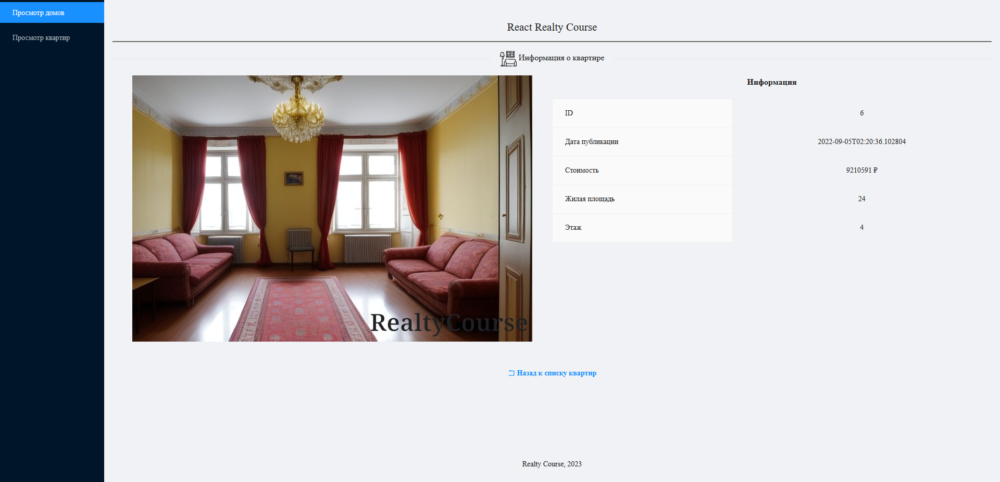
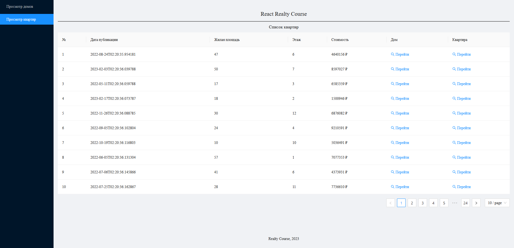

# SPA реестр фейковых квартир на продажу

## Стек
- .NET Core 3.1
- EF 5
- react
- react-redux
- redux-thunk
- Ant Design


## Заполняем базу данных новыми фейковыми данными с картинками
Переходим в проект DatabaseSeeder, добавляем свои картинки по необходимости.
Запускаем команду
```
python -m venv venv
.\venv\Scripts\activate.bat
pip install -r requirements.txt
python -m generate_data.py "строка подключения вида mssql+pyodbc://" "абсолютный путь к папке RealtyCourse.Frontend\wwwroot\images"
```


## Локально применяем миграции через команды
```powershell
dotnet ef migrations add имя_миграции -c RealtyContext --project ..\RealtyCourse.DAL
dotnet ef database update -c RealtyContext --project ..\RealtyCourse.DAL
```

-----
</br>



###### Все картинки домов и квартир сгенерированы нейросетью.